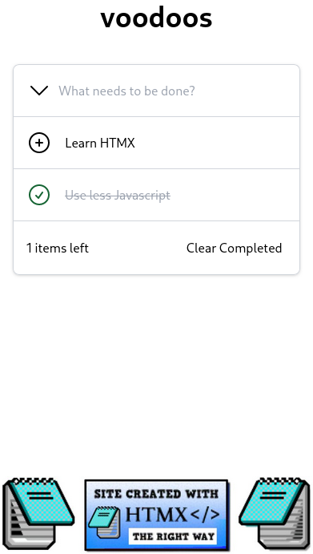

# voodoo
Todo website written in V, styled by Tailwindcss, and made possible by HTMX

## Link to Overview
[Watch the overview](https://youtu.be/28wZe8ufwLQ)

## Branch Selection
The main branch contains base starting code for you to work off of after watching the overview to get an idea of the project. Once you have completed it take a look at the finished_code branch to compare what you did. 
